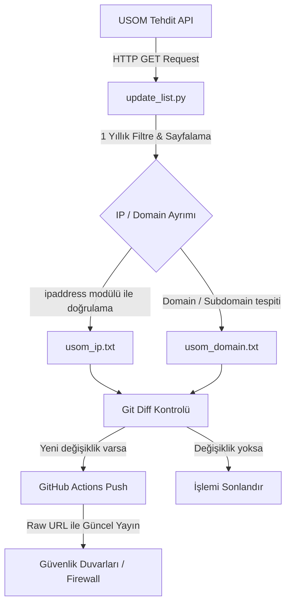

# USOM-API-Converter 🛡️🚀

[](https://github.com/beratcemzengin/USOM-API-Converter/actions/workflows/main.yml)
[](https://www.python.org/)
[](LICENSE)
[](https://www.usom.gov.tr)

**USOM-API-Converter**, Bilgi Teknolojileri ve İletişim Kurumu (BTK) bünyesindeki **Ulusal Siber Olaylara Müdahale Merkezi (USOM)** API servisleri üzerinden sunulan güncel tehdit istihbaratını (zararlı bağlantılar/adresler) otomatik olarak çeken, temizleyen, ayrıştıran ve kurumsal güvenlik duvarlarının (Palo Alto, FortiGate, Cisco FTD vb.) doğrudan dinamik liste (EDL / Threat Feed) olarak tüketebileceği optimize edilmiş formatta sunan kurumsal bir otomasyon projesidir.

---

## 💡 Hızlı Kullanım (Hazır Dinamik Listeler)

Kendi GitHub altyapınızı kurmak veya kod çalıştırmak istemiyorsanız, bu deponun GitHub Actions aracılığıyla **her gün otomatik olarak ürettiği** güncel ve tekilleştirilmiş listeleri doğrudan Firewall cihazlarınıza dinamik nesne olarak tanımlayabilirsiniz:

* 🔗 **Güvenilir IP Listesi (L3/L4):**  
  `https://raw.githubusercontent.com/beratcemzengin/USOM-API-Converter/main/usom_ip.txt`
* 🔗 **Güvenilir Domain Listesi (L7):**  
  `https://raw.githubusercontent.com/beratcemzengin/USOM-API-Converter/main/usom_domain.txt`

---

## 🌟 Öne Çıkan Özellikler

* **Akıllı Segmentasyon:** Tehditler IP (IPv4 & IPv6) ve Domain olarak otomatik ayrıştırılır. L3/L4 engelleme kuralları ile L7 URL filtreleme kurallarınızı bağımsız yönetebilirsiniz.
* **Kusursuz IP Doğrulama:** Python'ın yerleşik `ipaddress` kütüphanesi kullanılarak sıkıştırılmış IPv6 adresleri (örn: `2001:db8::1`) de dahil olmak üzere tüm IP formatları %100 doğrulukla tespit edilir.
* **Fail-Safe Hata Yönetimi:** API'de yaşanabilecek olası kesintilerde veya ağ hatalarında script hata kodu fırlatarak durur. Mevcut sağlam listelerinizin üzerine boş veya eksik veri yazılmasını (Fail-Insecure durumunu) engeller.
* **Hafıza (TCAM/RAM) Dostu:** Firewall cihazlarınızın bellek limitlerini yormamak adına varsayılan olarak **son 1 yılın** taze tehditleri filtrelenir.
* **Serverless Otomasyon:** GitHub Actions üzerinde çalışarak sunucu maliyeti gerektirmeden günde 1 kez otomatik tetiklenir.

---

## ⚙️ Çalışma Mimarisi (Workflow)



---

## 🔗 Firewall Entegrasyon Rehberi

### 🛡️ Palo Alto Networks (EDL Entegrasyonu)

Palo Alto Networks üzerinde tehdit listelerini **External Dynamic Lists (EDL)** olarak tanımlayarak güvenlik politikalarınızda dinamik olarak engelleyebilirsiniz.

1. **Web Arayüzü:** `Objects > External Dynamic Lists` yolunu izleyin.
2. **IP Listesi Ekleme:**
   - **Name:** `USOM-IP-List`
   - **Type:** `IP List`
   - **Source:** `https://raw.githubusercontent.com/beratcemzengin/USOM-API-Converter/main/usom_ip.txt`
   - **Repeat:** `Daily` (Günlük güncelleme saatini belirleyin)
3. **Domain Listesi Ekleme:**
   - **Name:** `USOM-Domain-List`
   - **Type:** `Domain List`
   - **Source:** `https://raw.githubusercontent.com/beratcemzengin/USOM-API-Converter/main/usom_domain.txt`
   - **Repeat:** `Daily`
4. **Kural Tanımlama:** `Policies > Security` kısmında yeni bir kural oluşturun. **Destination** alanına `USOM-IP-List` nesnesini, **Service/URL Category** alanına `USOM-Domain-List` nesnesini ekleyin ve aksiyonu **Drop/Block** olarak set edin.

---

### 🛡️ Fortinet FortiGate (Threat Feeds Entegrasyonu)

FortiGate cihazlarında bu listeleri **Security Fabric** altındaki **Fabric Connectors (Threat Feeds)** özelliğiyle entegre edebilirsiniz.

#### Web UI Yöntemi:
1. `Security Fabric > Fabric Connectors` menüsüne gidin.
2. **Create New** butonuna tıklayın ve **Threat Feeds** başlığı altından:
   - IP'ler için: **IP Address** seçeneğini seçin. URL alanına `usom_ip.txt` linkini girin.
   - Domain'ler için: **Domain Name** seçeneğini seçin. URL alanına `usom_domain.txt` linkini girin.
3. **Refresh Rate** değerini `1440` (Günlük - 24 saat) dakika olarak ayarlayın.

#### CLI Yöntemi:
```fortinet
config system external-resource
    edit "USOM-IP-Feed"
        set category 1
        set resource "https://raw.githubusercontent.com/beratcemzengin/USOM-API-Converter/main/usom_ip.txt"
        set refresh 1440
    next
    edit "USOM-Domain-Feed"
        set category 3
        set resource "https://raw.githubusercontent.com/beratcemzengin/USOM-API-Converter/main/usom_domain.txt"
        set refresh 1440
    next
end
```

---

## 🛠️ Kendi Altyapınıza Kurulum ve Çalıştırma

Eğer bu projeyi fork edip kendi kurumsal deponuz üzerinden çalıştırmak isterseniz aşağıdaki adımları izleyebilirsiniz.

### 1. Depoyu Fork Edin
Sağ üst köşedeki **"Fork"** butonuna basarak projeyi kendi profilinize veya şirket organizasyonunuza kopyalayın.

### 2. GitHub Actions İzinlerini Ayarlayın
GitHub Actions'ın güncellenen listeleri commit edip depoya geri yükleyebilmesi (push yetkisi) için:
1. Deponuzda **Settings > Actions > General** sekmesine gidin.
2. Sayfanın altındaki **Workflow permissions** alanında **"Read and write permissions"** seçeneğini işaretleyip **Save** butonuna basın.

### 3. Lokal Çalıştırma ve Test (Opsiyonel)
Scripti yerel bilgisayarınızda test etmek için:

```bash
# 1. Projeyi bilgisayarınıza klonlayın
git clone https://github.com/KULLANICI_ADINIZ/USOM-API-Converter.git
cd USOM-API-Converter

# 2. Sanal ortam (venv) oluşturun ve aktif edin
python -m venv venv
# Windows için:
venv\Scripts\activate
# Linux/macOS için:
source venv/bin/activate

# 3. Bağımlılıkları yükleyin
pip install -r requirements.txt # (Sadece requests kütüphanesi yeterlidir)

# 4. Scripti çalıştırın
python update_list.py
```

İşlem bittiğinde dizinde güncel `usom_ip.txt` ve `usom_domain.txt` dosyalarının oluştuğunu göreceksiniz.

---

## 📊 Teknik Parametreler

* **Sayfalama (Pagination):** API istekleri `per-page=1000` parametresi ile optimize edilmiş olup, sunucuyu yormamak adına her istek arasında `0.5` saniye bekleme süresi (`time.sleep`) bırakılmıştır.
* **Zaman Filtresi:** `date_gte` parametresi kullanılarak son 365 günün verileri filtrelenir.
* **Çalışma Zamanı (Cron):** GitHub Action her sabah Türkiye saati ile **06:00**'da (`0 3 * * *` UTC) tetiklenir.

---

## ⚖️ Lisans

Bu proje **MIT Lisansı** altında lisanslanmıştır. Detaylar için [LICENSE](LICENSE) dosyasına göz atabilirsiniz.
